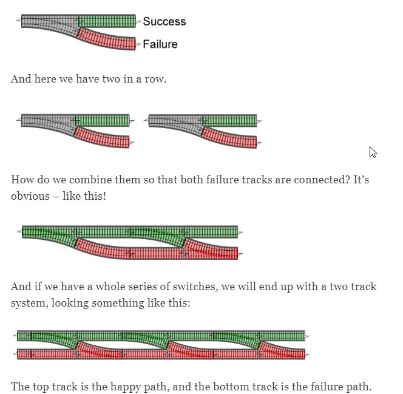

# fp-ts-presentation

## Examples

Run with `yarn ts-node <file>.ts`

* [Basic pipe](pipe.ts)
* [Either example with app](eitherapp.ts)

[Railway oriented programming | F# for fun and profit](https://fsharpforfunandprofit.com/posts/recipe-part2/)

## Links

### Tutorials

* [Practical Guide to Fp-ts P1: Pipe and Flow - DEV Community](https://dev.to/ryanleecode/practical-guide-to-fp-ts-pipe-and-flow-4e9n)
* [functional-fest/slides at master · giogonzo/functional-fest · GitHub](https://github.com/giogonzo/functional-fest/tree/master/slides)
* [FunctionalFest • TypeScript & FP: an introduction • Giovanni Gonzaga - YouTube](https://www.youtube.com/watch?v=1LCqHnaJJtY)
* [fp-ts guild at maas global](https://github.com/maasglobal/typescript/tree/master/maasglobal-guide-ts)
* [Getting started with fp-ts: Eq - DEV Community](https://dev.to/gcanti/getting-started-with-fp-ts-setoid-39f3)
* [Interoperability with non functional code using fp-ts - DEV Community](https://dev.to/gcanti/interoperability-with-non-functional-code-using-fp-ts-432e)
* [Data fetching in React the functional way powered by TypeScript, io-ts & fp-t&#x2026;](https://dev.to/remojansen/data-fetching-in-react-the-functional-way-powered-by-typescript-io-ts--fp-ts-ojf)
* [Enough fp-ts to work with io-ts - DEV Community](https://dev.to/gillchristian/enough-fp-ts-to-work-with-io-ts-20ip)
* [Should I use fp-ts Task? - DEV Community](https://dev.to/anthonyjoeseph/should-i-use-fp-ts-task-h52)
* [Anthony G - DEV Community - A few articles](https://dev.to/anthonyjoeseph)
* [fp-ts, sequenceT, and sweet sweet async typed FP - DEV Community](https://dev.to/gnomff_65/fp-ts-sequencet-and-sweet-sweet-async-typed-fp-5aop)
* [fp-ts and Beautiful API Calls - DEV Community](https://dev.to/gnomff_65/fp-ts-and-beautiful-api-calls-1f55)
* [Functors, Applicatives, And Monads In Pictures - adit.io](https://adit.io/posts/2013-04-17-functors,_applicatives,_and_monads_in_pictures.html)
* [Option: fp-ts - DEV Community](https://dev.to/waynevanson/fp-ts-meets-if-else-and-switch-part-1-3-2lpf)
* [Functional programming in typescript using fp-ts: ReaderTaskEither - DEV Comm&#x2026;](https://dev.to/peerhenry/functional-programming-in-typescript-using-fp-ts-readertaskeither-1pei)
* [Zaetrik – Medium](https://medium.com/@zaetrik)

### Libraries and Apps

* [GitHub - Brettm12345/twending: Yet another github trending web application](https://github.com/Brettm12345/twending)
* [GitHub - samhh/fp-ts-std: The missing pseudo-standard library for fp-ts.](https://github.com/samhh/fp-ts-std)
* [As compared to Ramda - fp-ts-std](https://samhh.github.io/fp-ts-std/ramda)
* [GitHub - devexperts/remote-data-ts: RemoteData type](https://github.com/devexperts/remote-data-ts)
* [GitHub - maasglobal/io-ts-validator: Convenience wrapper for io-ts codecs](https://github.com/maasglobal/io-ts-validator#input-decoding)
